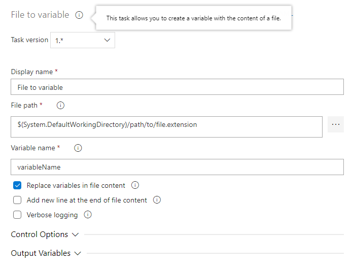

# Replace variables in file

This task allows you to create a runtime variable that store the content of a file.

## Options

### File path

With this property you can specify the path of the file including its name. Example: 'folder/filename.txt'.

### Variable name

With this property you can specify the name of the variable, a valid variable name includes only letter, numbers or underscore, examples: foo, bar, myVar, variable1, a_var.

### Replace variables

When this is checked, the variables found in the file content will be replaced by their corresponding values.

### End file with a new line

When this is checked, the task add a new line at the end of the file content.

### Verbose logging

When this is checked, the task write detailed process logs.